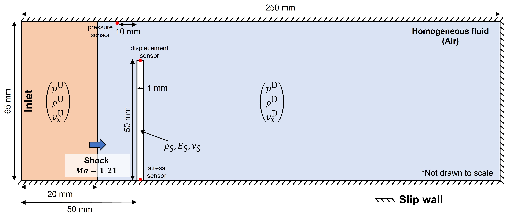
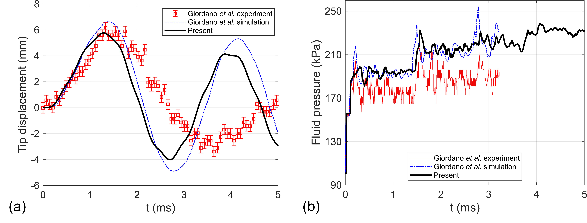
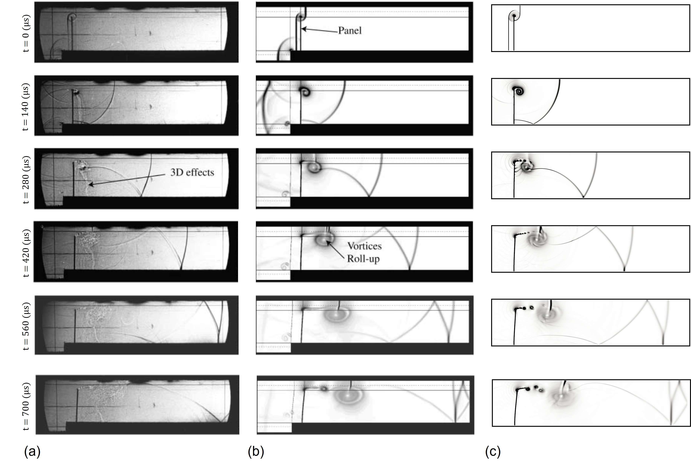

# Model problem

This example case presents the coupled fluid-structure interaction problem
in which a deforming cantilever beam is subjected to a planar shock wave. 

# Comparison with reference

This problem has been studied both numerically and experimentally by
Giordano *et. al.* in "Shock wave impacts on deforming panel, an application 
of fluid-structure interaction."

In the figure below, subfigure **(a)** compares the time history of horizontal 
tip displacement obtained from the present FSI simulation against the 
experimental and numerical results reported by the reference. The peak
displacement observed in our simulation during the first oscillation cycle
is approximately **5.76 mm**, which agrees well with the experimental
measurement of **6.2 ± 0.4 mm** and the numerical prediction of **6.6 mm**
reported in the reference.

The fluid pressure time history recorded at the pressure sensor placed upstream
of the flexible panel is plotted in subfigure **(b)**. The simulation
captures the initial pressure jump due to the incident shock, followed by
unsteady fluctuations resulting from shock reflections and panel motion.

A qualitative comparison of the overall fluid dynamics is presented below by
comparing the synthetic Schlieren fields from the present study 
(subfigure **(c)**) with the numerical Schlieren (subfigure **(b)**) and
experimental shadowgraph (subfigure **(a)**) images extracted from the 
reference.

